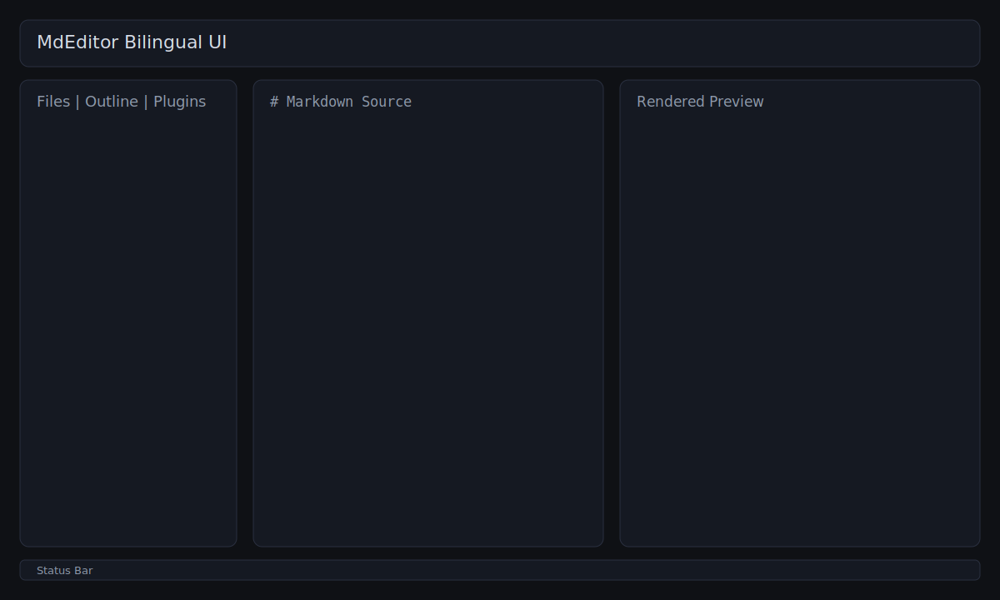
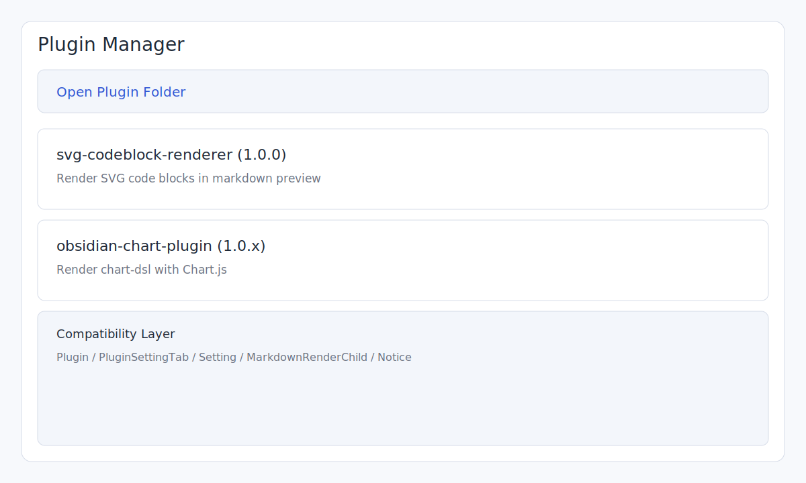
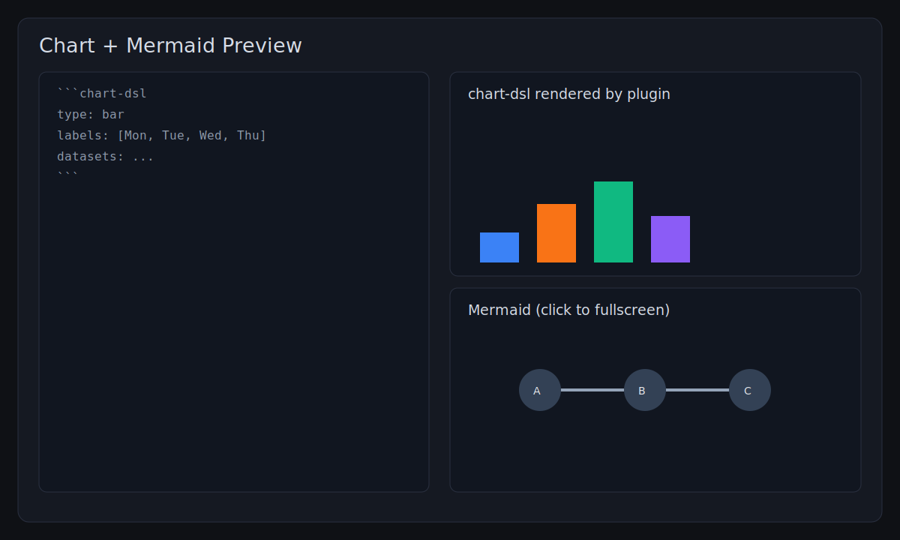

# MdEditor / Markdown 编辑器

> 中文 | [English](#english)

MdEditor 是一个面向桌面场景的 Markdown 阅读与编辑工具，灵感来自 Obsidian，重点在于：

- 阅读模式 + 编辑模式
- 本地文件直开直存
- 插件目录自动加载
- Markdown 导出 PDF
- Mermaid / Chart 插件渲染
- 中英文双语界面（Internationalization）

## 中文

### 1. 产品截图（示意）

> 以下为仓库内置界面示意图，可在 GitHub 直接预览。





### 2. 功能特性

- **编辑体验**：源码编辑、实时渲染预览、查找替换、右键插入常用 Markdown 片段。
- **阅读体验**：大纲导航、阅读模式、状态栏统计、Mermaid 全屏查看（缩放/拖动/重置）。
- **文件能力**：打开文件、打开文件夹、保存/另存为、最近文件、系统关联打开。
- **导出能力**：导出 PDF（页面尺寸、边距、缩放、导出后定位文件）。
- **插件能力**：应用目录内置插件 + Obsidian 兼容层，支持 `svg-codeblock-renderer`、`obsidian-chart-plugin`。
- **国际化**：界面语言支持 `中文` / `English`，可在“选项”中切换。

### 3. 运行方式

#### Web 开发模式

```bash
npm install
npm run dev
```

#### 桌面开发模式（推荐调试）

```bash
npm install
npm run dev:desktop
```

#### 构建前端产物

```bash
npm run build
```

#### Windows 打包（安装包 + 可执行文件）

```bash
npm run dist:win
```

打包产物位于 `release/`：

- 安装包：`MdEditor Setup <version>.exe`
- 解包可执行：`release/win-unpacked/MdEditor.exe`

> 版本号会在打包时自动递增补丁版本（如 `1.0.2 -> 1.0.3`）。

### 4. 插件目录与内置插件

- 插件目录（开发仓库）：`plugins/`
- 打包后目录：`release/win-unpacked/plugins/`
- 当前内置：
  - `svg-codeblock-renderer`
  - `obsidian-chart-plugin`

当前兼容层主要覆盖：

- `Plugin`
- `PluginSettingTab`
- `Setting`
- `MarkdownRenderChild`
- `Notice`
- `registerMarkdownPostProcessor(...)`
- `registerMarkdownCodeBlockProcessor(...)`

### 5. 文件关联（Windows）

安装包默认关联：

- `.md`
- `.markdown`

双击上述文件可直接用 MdEditor 打开；若程序已运行，会将文件转发到当前窗口。

---

## English

### 1. Screenshots (Illustrations)

The repository includes built-in UI illustrations that are GitHub-friendly:


### 2. Key Features

- **Editing**: source editor, live preview, find/replace, context-menu snippet insertion.
- **Reading**: outline navigation, read mode, status metrics, fullscreen Mermaid interactions.
- **File workflow**: open file/folder, save/save-as, recent files, OS file-open integration.
- **Export**: Markdown to PDF with page size, margin, scale, and reveal-after-export.
- **Plugins**: bundled plugins + Obsidian-compatible bridge (`svg-codeblock-renderer`, `obsidian-chart-plugin`).
- **Internationalization**: bilingual UI (`中文` / `English`) selectable in Options.

### 3. Run

#### Web dev mode

```bash
npm install
npm run dev
```

#### Desktop dev mode

```bash
npm install
npm run dev:desktop
```

#### Production frontend build

```bash
npm run build
```

#### Windows packaging

```bash
npm run dist:win
```

Outputs in `release/`:

- Installer: `MdEditor Setup <version>.exe`
- Unpacked executable: `release/win-unpacked/MdEditor.exe`

Version patch number is auto-incremented during packaging.

### 4. Plugin Locations

- Source plugin folder: `plugins/`
- Packaged plugin folder: `release/win-unpacked/plugins/`

Obsidian compatibility subset currently includes:

- `Plugin`, `PluginSettingTab`, `Setting`, `MarkdownRenderChild`, `Notice`
- Markdown post/code block processor registration APIs
